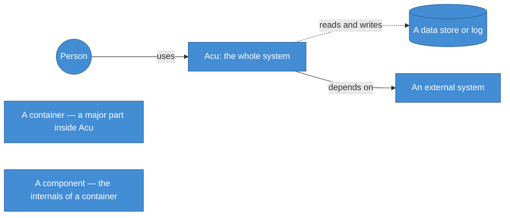
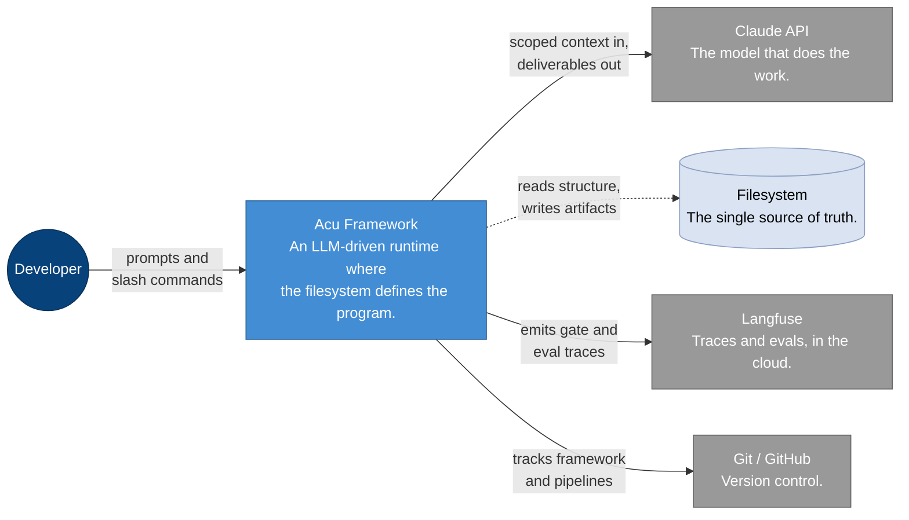
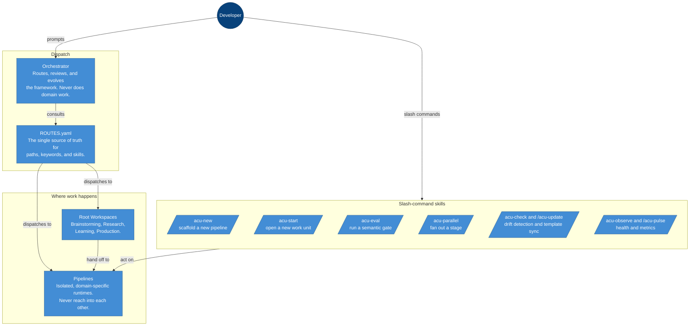
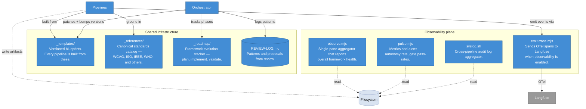
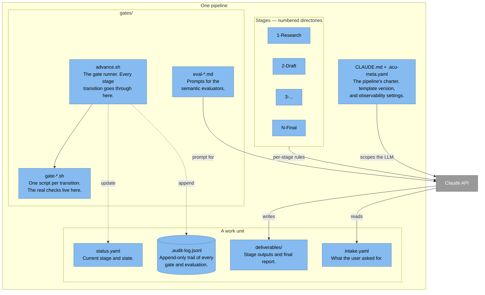
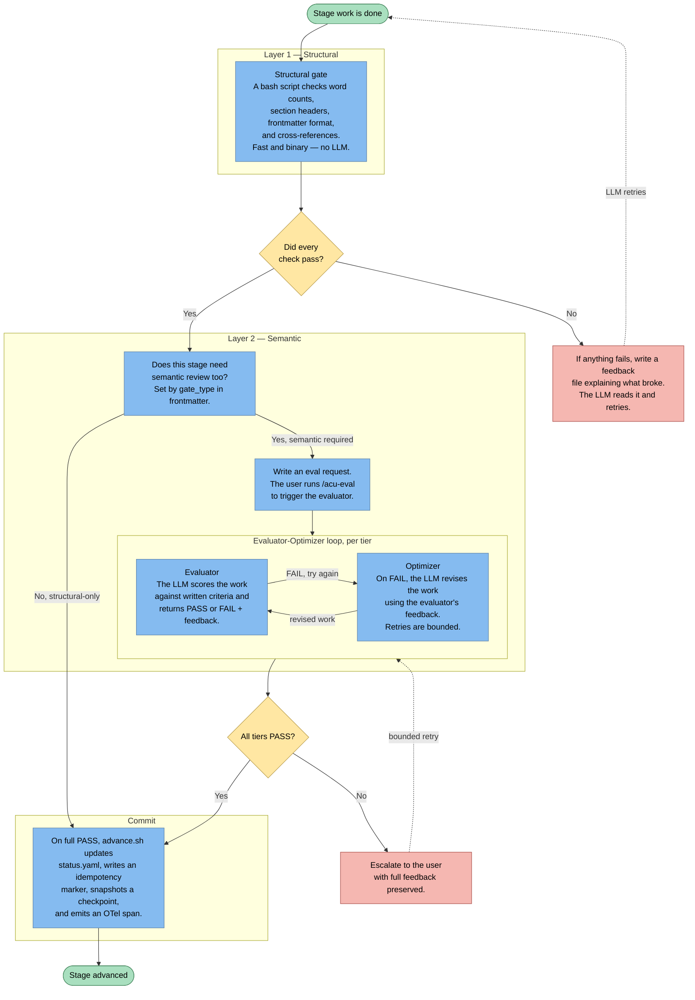
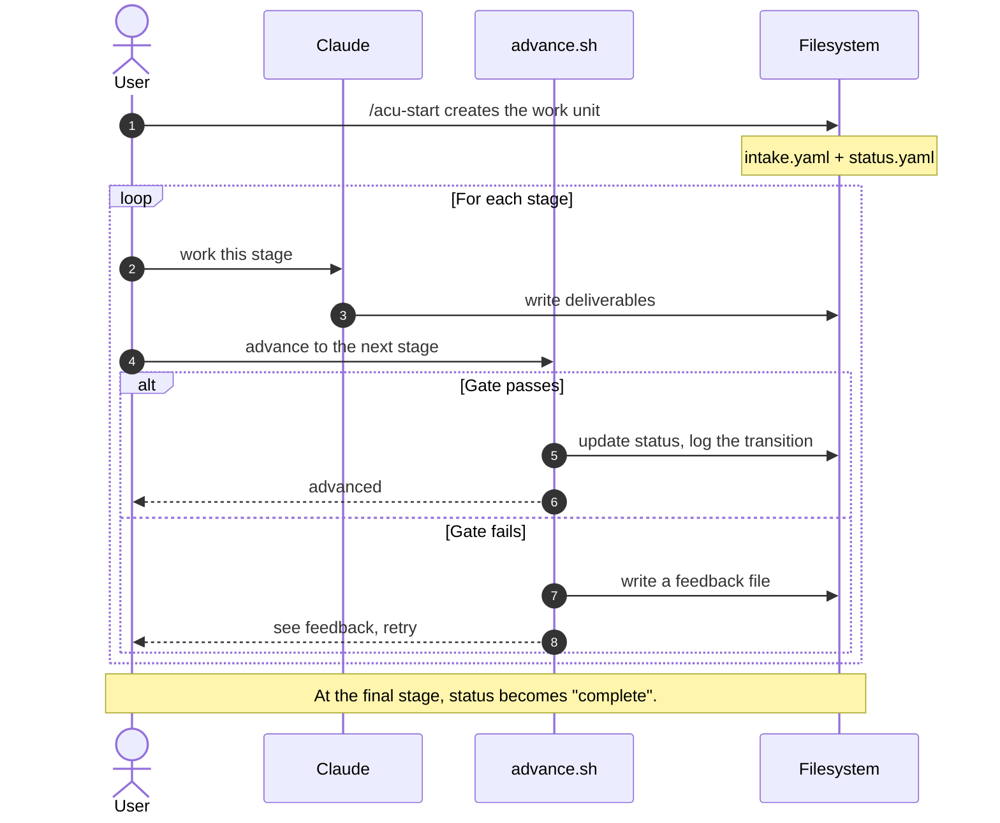
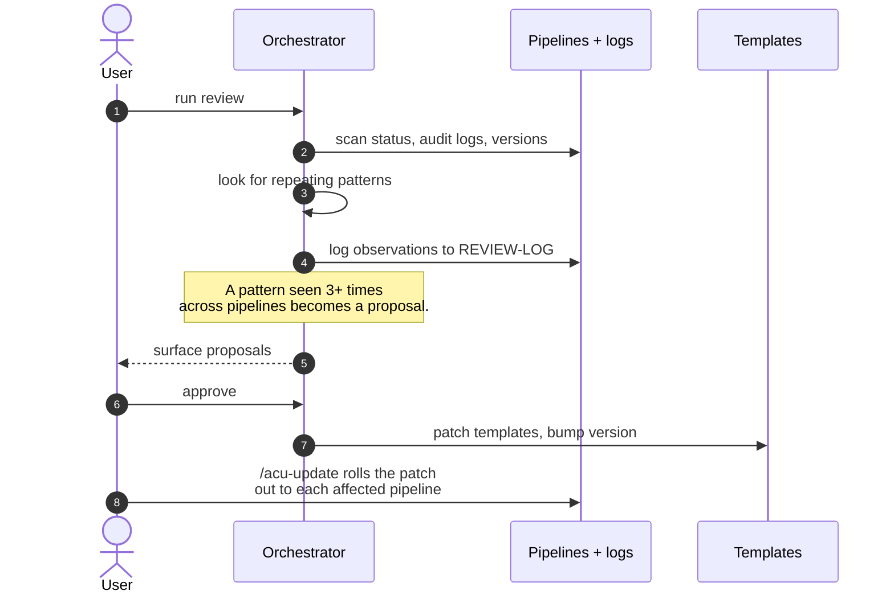

# Acu — Architecture Reference

A professional reference for how the Acu framework is built. Organized with the [C4 model](https://c4model.com/), an industry-standard notation that describes a system at progressively finer zoom levels.

> **Scope.** This document describes *Acu the framework* — the runtime, the Orchestrator, gates, templates, and observability. It does not describe any individual pipeline's domain logic; those live in each pipeline's own `CLAUDE.md`.

---

## How to Read This Document

Each zoom level answers a different question. You can stop reading at whichever level answers yours.

| Level | What it shows | Good for |
|------:|---------------|----------|
| 1 | Acu as a single box with the people and services around it | Understanding what Acu *is* |
| 2 | The major parts inside Acu and how they relate | Operators, new contributors |
| 3 | The internals of the interesting parts | Deep contributors |
| — | Flows over time (sequence, lifecycle) | Anyone tracing behavior |

All diagrams are written in [Mermaid](https://mermaid.js.org/) so they render natively in GitHub, VS Code, and most docs tools — no extra tooling required.

### Legend

- **Solid arrow** — a direct call or invocation
- **Dashed arrow** — reading or writing files, appending to a log
- **Rounded circle** — a person
- **Cylinder** — a data store or append-only log
- **Grey box** — something outside Acu that Acu talks to

---

## Level 1 — The System in Context

One box for Acu, the people and services that touch it. Nothing else.

**What this tells you**

Acu is a *framework*, not a running service. There is no server to deploy. The runtime is a Claude session plus a normal filesystem. The LLM is the executor; determinism is recovered at the **gate** boundary (covered in Level 3). Observability is optional per pipeline — when off, Acu still keeps a complete local audit trail.

---

## Level 2 — The Parts Inside Acu

Level 2 is split into two views so each stays readable: a **control plane** (how work gets routed and done) and a **shared plane** (what every pipeline draws from, plus observability).

### 2a. Control plane — how work flows

**What this tells you**

Every request enters through the **Orchestrator** or a **slash command**. The Orchestrator does not do domain work — it reads `ROUTES.yaml`, figures out where the work belongs, and sends it there. Pipelines are isolated from each other by design; cross-pipeline operations only happen through the Orchestrator.

### 2b. Shared plane — blueprints, standards, and observability

**What this tells you**

Pipelines are generated *from* `_templates/` — so every pipeline has the same shape. Templates are versioned as a set; `/acu-check` detects drift and `/acu-update` applies patches. The Orchestrator is the only thing that modifies templates, and only after seeing a pattern repeat across pipelines. Observability is a **bolt-on** — every piece of it reads the same filesystem Acu already writes to, so turning it off costs nothing.

---

## Level 3a — Inside a Pipeline

Zooming into one pipeline. Every pipeline looks like this because they are all generated from the same templates.

**What this tells you**

A pipeline is a **charter plus four folders**: stages (numbered directories), gates, work-unit data, and a few config files. Stages are just directories — `ls` is the state-machine diagram. `advance.sh` is the only thing that should ever edit `status.yaml`; editing it by hand would break the audit trail.

When a gate runs, `advance.sh` also writes a handful of bookkeeping files — feedback on failure, idempotency markers on success, checkpoint snapshots, and eval-request files when semantic review is needed. Those belong to the gate flow and are covered in the next section.

---

## Level 3b — The Two-Layer Gate

Acu's central quality mechanism. Every stage transition passes through here. The pattern is the [Evaluator-Optimizer loop](https://www.anthropic.com/research/building-effective-agents) from Anthropic's *Building Effective Agents* — with a deterministic first layer on top to catch mechanical mistakes cheaply.

**Why two layers**

- **Layer 1 is cheap.** Shell-only; catches the bulk of failures that are mechanical — a missing file, an empty section, a wrong cross-reference. No tokens spent.
- **Layer 2 is nuanced.** Only runs after Layer 1 passes. The LLM judges the *quality* of what Layer 1 confirmed is *shaped* correctly.
- **Three evaluation tiers** can compose via `eval_chain`:
  - **stage** — active; evaluates one stage's deliverables.
  - **pipeline** — active at the final stage; evaluates the whole work unit end-to-end against the original ask.
  - **system** — reserved for the Orchestrator; evaluates the pipeline itself against framework standards.

---

## Flow 1 — The Life of a Work Unit

A work unit is born in `intake.yaml` and dies when `status.yaml` says `complete`.

The "Gate passes" branch folds both outcomes (structural-only and structural + semantic) into one line. The detail of that inner process lives in Level 3b — this view is just *the life of a work unit*.

---

## Flow 2 — The Orchestrator's Review-Push Cycle

This is how framework improvements happen. The Orchestrator is the only seam with visibility across pipelines, so it is the only thing qualified to say "this pattern is repeating."

The rule is simple: one observation is a one-off, two are tracked, three justify a proposal. Proposals wait for human approval before touching templates.

---

## Flow 3 — Parallel Stages

Stages that opt in (`parallel_eligible: true` in frontmatter) can fan out into multiple workers.

```mermaid
flowchart LR
    Stage[A stage marked<br/>parallel-eligible]

    subgraph Strat[The strategy &#40;chosen in frontmatter&#41;]
        direction TB
        S1[split-by-subtask<br/>partition the work;<br/>each worker owns a slice.]
        S2[competing<br/>several workers attempt<br/>the same task; best wins.]
        S3[competing-teams<br/>teams of workers compete;<br/>best team output wins.]
    end

    subgraph Workers[Parallel workers]
        direction LR
        W1[Worker 1]
        W2[Worker 2]
        Wn[Worker N]
    end

    subgraph Resolve[How outputs come back together]
        direction TB
        Merge[Merge — synthesize the slices<br/>into one deliverable.]
        Select[Select — an evaluator picks<br/>the winning output.]
    end

    Deliv[The stage's final deliverable.<br/>Enters the normal two-layer gate.]

    Stage --> Strat --> Workers
    Workers --> Merge
    Workers --> Select
    Merge --> Deliv
    Select --> Deliv

    classDef default fill:#85BBF0,stroke:#5D82A8,color:#000
```

**What this tells you**

Parallelism changes *how the work is done*, not *how it is judged*. The merged or selected output re-enters the same two-layer gate. The stage doesn't know (and doesn't care) whether its deliverable came from one worker or ten.

---

## Principles at a Glance

The diagrams show what Acu is. These principles show what keeps it coherent. Full versions live in `CLAUDE.md`.

**Architectural — what Acu is**

- **Isolation.** Pipelines don't see each other. Only the Orchestrator crosses boundaries.
- **Two-layer gates.** Every transition passes a structural check and, where configured, a semantic one. Nothing advances without both.
- **Structure as schema.** Templates define the shape. Validation is structural, not semantic.
- **Audit trail.** Every transition is logged, and logs aggregate across pipelines.
- **Threat model.** Pipeline isolation and defined attack surfaces — see `THREAT-MODEL.md`.

**Engineering — how Acu is built**

- **Low learning friction.** Prefer optional over required, legible over clever.
- **Durability over expediency.** Fix it properly, or note that you didn't. Never leave a workaround unlabeled.

---

## Where to Find Everything

| Concern | File |
|---------|------|
| Routing (source of truth) | [ROUTES.yaml](../ROUTES.yaml) |
| Orchestrator behavior | [Orchestrator/CLAUDE.md](../Orchestrator/CLAUDE.md) |
| Framework charter | [CLAUDE.md](../CLAUDE.md) |
| Pipeline index | [pipelines/CLAUDE.md](../pipelines/CLAUDE.md) |
| Templates (versioned) | [_templates/](../_templates/) |
| Gate mechanics | [_templates/advance.sh.template](../_templates/advance.sh.template) |
| Semantic evaluator prompt | [_templates/eval-gate.md.template](../_templates/eval-gate.md.template) |
| Agent-engineering rationale | [_templates/methods/agent-engineering.md](../_templates/methods/agent-engineering.md) |
| Security posture | [THREAT-MODEL.md](../THREAT-MODEL.md) |
| Observability | [observe.mjs](../observe.mjs) · [pulse.mjs](../pulse.mjs) · [emit-trace.mjs](../emit-trace.mjs) · [syslog.sh](../syslog.sh) |
| Review cadence | [REVIEW-LOG.md](../REVIEW-LOG.md) |
| Onboarding | [QUICKSTART.md](../QUICKSTART.md) |

---

Notation: [C4 model](https://c4model.com/). Diagrams: [Mermaid](https://mermaid.js.org/). Evaluator-Optimizer pattern: Anthropic, *Building Effective Agents*.
